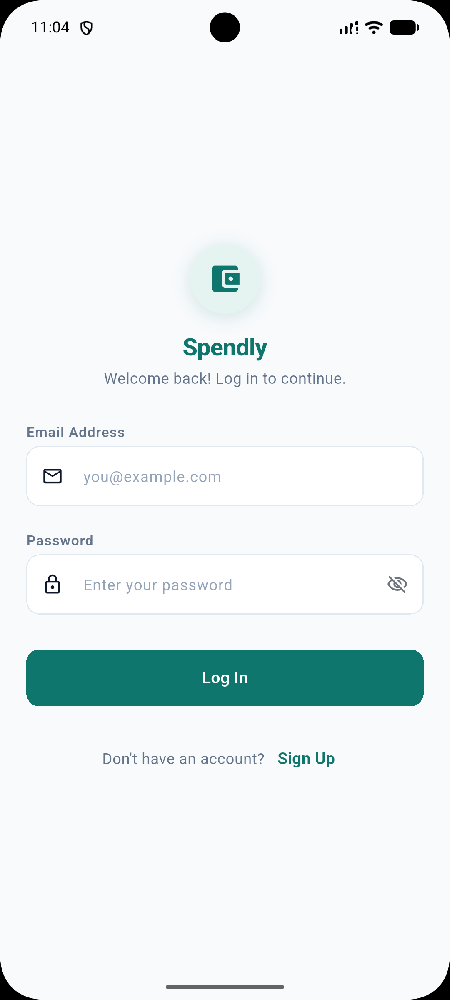
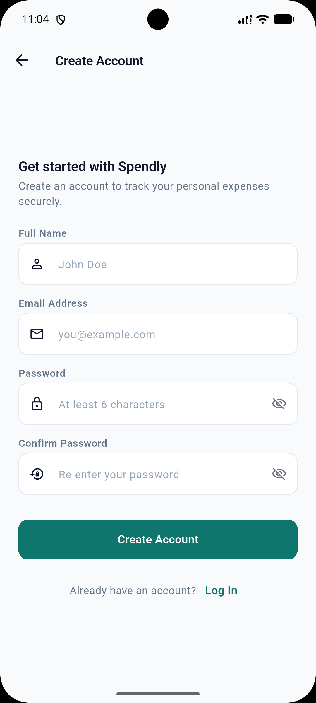
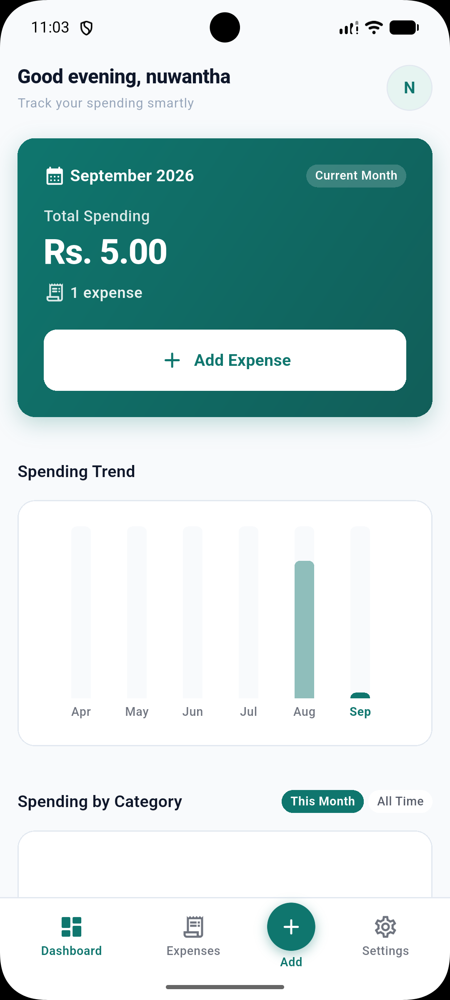
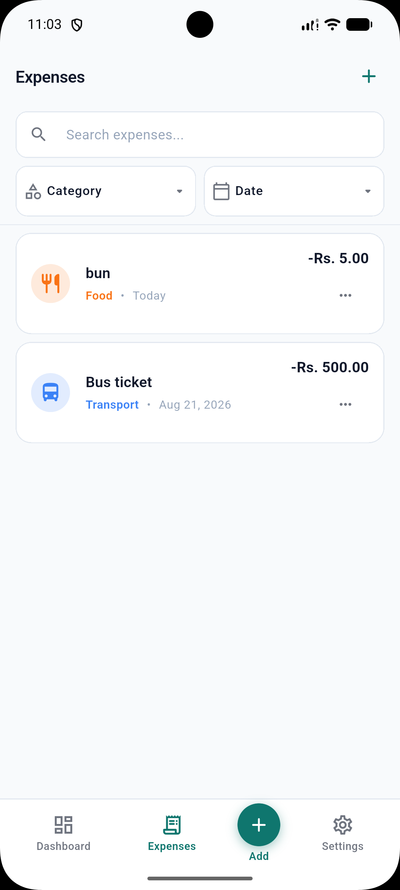
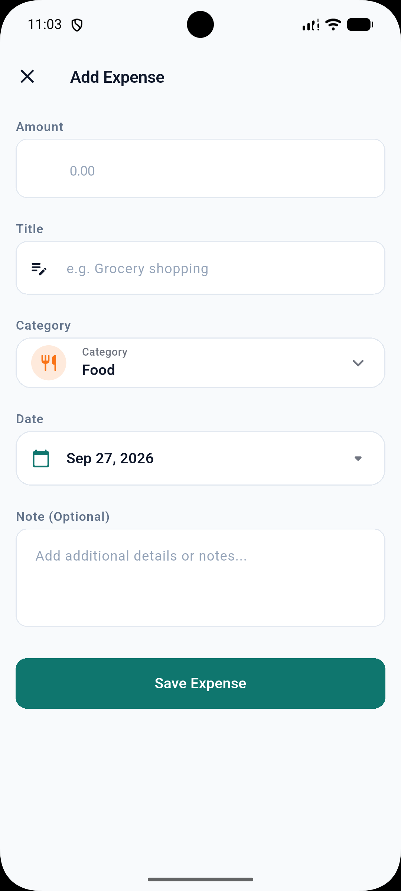
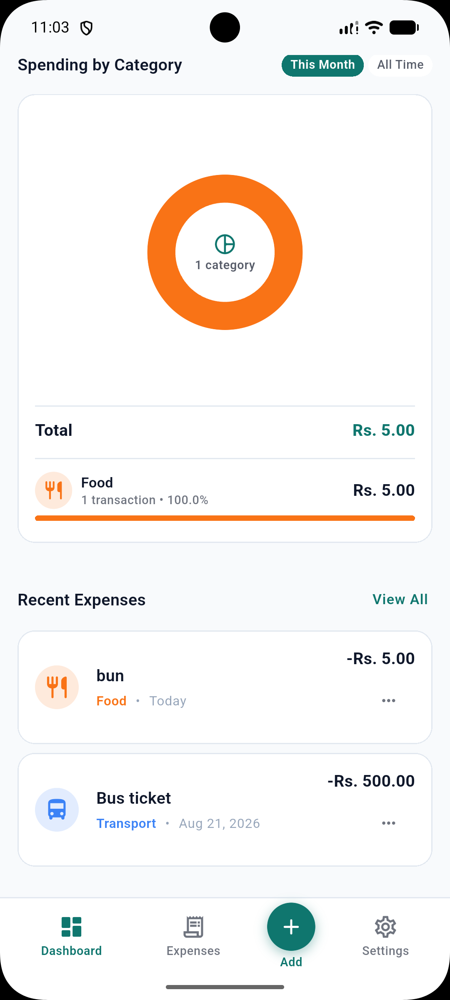
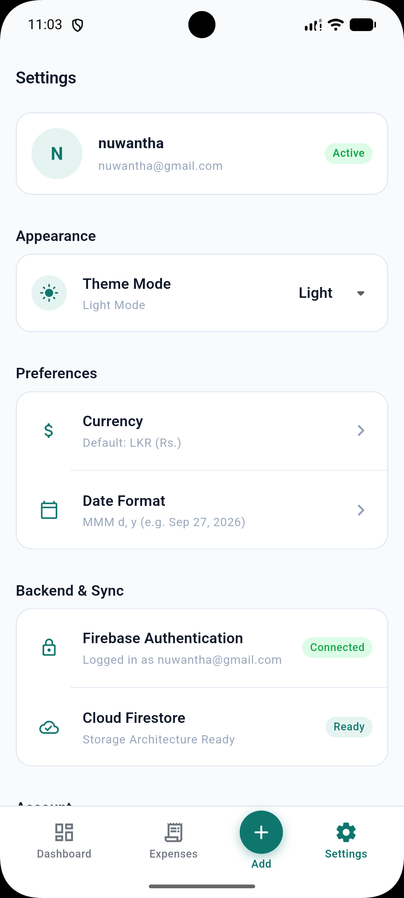

# Spendly

A modern Flutter expense tracker application that allows users to securely manage, analyse, and track their personal expenses using Firebase. Built with a clean feature-first architecture, Riverpod state management, and a polished Material 3 UI with full Light and Dark mode support.

---

## Features

### Authentication
- User registration with name, email, and password
- Email and password login
- Secure logout
- Persistent authentication state across sessions

### Expense Management
- Add expenses with title, amount, category, date, and optional notes
- Edit existing expenses
- Delete expenses with confirmation dialog
- Predefined expense categories (Food, Transport, Shopping, Health, Entertainment, Education, Utilities, Other)
- Real-time Firestore sync — changes reflect instantly across the UI

### Dashboard
- Current month total spending
- Current month expense count
- Up to 5 recent expenses displayed inline
- Quick access to add a new expense

### Expense History
- Full list of all expenses, sorted by date (newest first)
- Search by title, category, or notes
- Filter by category
- Filter by date (Today, This Week, This Month, Last Month, custom date)
- Combined filter and search in a single, unified view
- Active filter chips with individual clear actions
- Empty and loading states handled throughout

### Analytics
- Category spending donut chart (fl_chart)
- Monthly spending trend bar chart (last 6 months)
- Category breakdown list with percentage and transaction count
- Toggle between "This Month" and "All Time" views

### UI & Theme
- Light and Dark mode
- Theme toggle available in the Settings screen
- Theme preference persisted across app restarts (SharedPreferences)
- Responsive layout using Material 3 design principles
- Smooth loading states, empty states, and error states throughout

### Security
- Firebase Authentication protects all user accounts
- Firestore Security Rules restrict each user to their own expense data
- No credentials or secrets committed to the repository

---

## Technology Stack

| Technology | Version | Purpose |
|---|---|---|
| [Flutter](https://flutter.dev) | SDK | UI framework |
| [Dart](https://dart.dev) | ^3.13.1 | Programming language |
| [firebase_core](https://pub.dev/packages/firebase_core) | ^3.12.1 | Firebase initialisation |
| [firebase_auth](https://pub.dev/packages/firebase_auth) | ^5.5.1 | User authentication |
| [cloud_firestore](https://pub.dev/packages/cloud_firestore) | ^5.6.5 | Real-time expense storage |
| [flutter_riverpod](https://pub.dev/packages/flutter_riverpod) | ^2.6.1 | State management |
| [fl_chart](https://pub.dev/packages/fl_chart) | ^1.1.1 | Expense analytics charts |
| [shared_preferences](https://pub.dev/packages/shared_preferences) | ^2.5.5 | Theme preference persistence |
| [intl](https://pub.dev/packages/intl) | ^0.20.2 | Date and number formatting |

---

## Architecture

Spendly uses a **feature-first Clean Architecture** approach. Each feature is self-contained with its own `data`, `domain`, and `presentation` layers.

```
lib/
├── app/
│   ├── app.dart                    # Root MaterialApp and theme setup
│   └── routes.dart                 # Navigation and AuthGate
│
├── core/
│   ├── constants/
│   │   ├── app_constants.dart      # App-wide constants
│   │   └── app_dimensions.dart     # Spacing, radius, icon size tokens
│   ├── theme/
│   │   ├── app_colors.dart         # Colour palette (light + dark)
│   │   ├── app_text_styles.dart    # Typography definitions
│   │   ├── app_theme.dart          # ThemeData (light and dark)
│   │   └── theme_provider.dart     # Riverpod theme toggle + SharedPreferences
│   ├── utils/
│   │   ├── currency_formatter.dart # LKR currency formatting
│   │   └── date_formatter.dart     # Human-readable date helpers
│   └── widgets/
│       ├── app_card.dart           # Reusable themed card
│       ├── empty_state.dart        # Empty state placeholder
│       ├── loading_indicator.dart  # Centred loading spinner
│       ├── primary_button.dart     # Styled primary action button
│       ├── section_title.dart      # Section header with optional action
│       └── spendly_app_bar.dart    # Custom app bar
│
├── features/
│   ├── auth/
│   │   ├── data/
│   │   │   ├── auth_service.dart
│   │   │   └── auth_exception_handler.dart
│   │   └── presentation/
│   │       ├── providers/
│   │       │   └── auth_providers.dart
│   │       ├── auth_gate.dart
│   │       ├── login_screen.dart
│   │       ├── register_screen.dart
│   │       └── splash_screen.dart
│   │
│   ├── expenses/
│   │   ├── data/
│   │   │   ├── expense_service.dart
│   │   │   └── firestore_exception_handler.dart
│   │   ├── domain/
│   │   │   ├── expense.dart
│   │   │   ├── expense_category.dart
│   │   │   ├── expense_filter_state.dart
│   │   │   ├── category_spending.dart
│   │   │   ├── monthly_expense_summary.dart
│   │   │   └── monthly_trend_item.dart
│   │   └── presentation/
│   │       ├── providers/
│   │       │   └── expense_providers.dart
│   │       ├── widgets/
│   │       │   ├── expense_list_tile.dart
│   │       │   └── category_selector.dart
│   │       ├── add_expense_screen.dart
│   │       └── expenses_screen.dart
│   │
│   ├── dashboard/
│   │   └── presentation/
│   │       ├── widgets/
│   │       │   ├── category_pie_chart.dart
│   │       │   ├── monthly_trend_bar_chart.dart
│   │       │   └── category_breakdown_tile.dart
│   │       └── dashboard_screen.dart
│   │
│   ├── settings/
│   │   └── presentation/
│   │       └── settings_screen.dart
│   │
│   └── navigation/
│
├── firebase_options.dart
└── main.dart
```

### Data Flow

```
UI (Screens / Widgets)
        ↓  watches / reads
Riverpod Providers
        ↓  calls
Service Layer  (ExpenseService, AuthService)
        ↓  reads / writes
Firebase  (Cloud Firestore, Firebase Authentication)
```

- **Screens** are `ConsumerWidget` / `ConsumerStatefulWidget` that `watch` Riverpod providers.
- **Providers** expose `StreamProvider` (real-time Firestore streams), `StateNotifierProvider` (controllers), and derived `Provider` (computed values such as filtered lists and analytics).
- **Services** wrap the Firebase SDK — no business logic in services.
- **Domain models** are plain Dart classes with `fromFirestore` / `toFirestore` conversion methods.

---

## Firebase Setup

### Authentication

Firebase Authentication is used for user account management with Email/Password sign-in enabled.

### Cloud Firestore Data Structure

Expenses are stored under a user-scoped sub-collection:

```
users/
 └── {userId}/
      └── expenses/
           └── {expenseId}
                ├── title       (String)
                ├── amount      (Number)
                ├── category    (String)
                ├── date        (Timestamp)
                ├── notes       (String, optional)
                └── createdAt   (Timestamp)
```

### Firestore Security Rules

```
rules_version = '2';
service cloud.firestore {
  match /databases/{database}/documents {
    match /users/{userId}/expenses/{expenseId} {
      allow read, write: if request.auth != null
                         && request.auth.uid == userId;
    }
  }
}
```

Unauthenticated requests and cross-user requests are denied by default.

---

## Prerequisites

- [Flutter SDK](https://docs.flutter.dev/get-started/install) (Dart SDK ^3.13.1 included)
- [Android Studio](https://developer.android.com/studio) or [VS Code](https://code.visualstudio.com/) with Flutter/Dart extensions
- An Android emulator or physical device
- A [Firebase](https://firebase.google.com/) project with **Authentication** (Email/Password) and **Cloud Firestore** enabled

---

## Installation & Setup

### 1. Clone the repository

```bash
git clone <your-repository-url>
cd spendy
```

### 2. Install dependencies

```bash
flutter pub get
```

### 3. Configure Firebase

1. Create a project at [console.firebase.google.com](https://console.firebase.google.com)
2. Enable **Authentication → Email/Password** sign-in
3. Create a **Cloud Firestore** database
4. Install the FlutterFire CLI:
   ```bash
   dart pub global activate flutterfire_cli
   ```
5. Run configuration from the project root:
   ```bash
   flutterfire configure
   ```
   This generates `lib/firebase_options.dart` and `android/app/google-services.json`.
6. Deploy the Firestore Security Rules shown above via the Firebase Console.

### 4. Run the application

```bash
flutter run
```

---

## Running the App

```bash
# Fetch all dependencies
flutter pub get

# Run in debug mode
flutter run

# List available devices
flutter devices

# Run on a specific device
flutter run -d <device-id>

# Run with release optimisations
flutter run --release
```

---

## Building a Release APK

```bash
flutter build apk --release
```

Output: `build/app/outputs/flutter-apk/app-release.apk`

> **Note:** Ensure `android/app/google-services.json` is present before building.

---

## Screenshots

### Login


### Register


### Dashboard


### Expense History


### Add / Edit Expense


### Analytics


### Settings


---


## AI Tools Used

- **Google Antigravity** — used for development assistance and debugging.

- **ChatGPT** — used for technical guidance and troubleshooting.

All implementation was reviewed and tested before integration.
## Security

- **Firebase Authentication** manages all user sessions. Unauthenticated users cannot access any screen beyond login and registration.
- **Firestore Security Rules** enforce server-side access control. Each user can only read and write their own expense documents.
- **No secrets are committed** to this repository. The `google-services.json` file is excluded via `.gitignore`.

---

## Future Improvements

- Monthly and category-level budget limits with alerts
- Export expenses to CSV or PDF
- Recurring expense tracking
- Advanced multi-period analytics and comparison reports
- Push notifications for spending milestones
- Multi-currency support
- Cloud backup and restore

---

## Project Information

| Item | Detail |
|---|---|
| **App Name** | Spendly |
| **Version** | 0.1.0+1 |
| **Platform** | Android (Flutter cross-platform) |
| **Language** | Dart |
| **State Management** | Riverpod |
| **Backend** | Firebase (Authentication + Firestore) |
